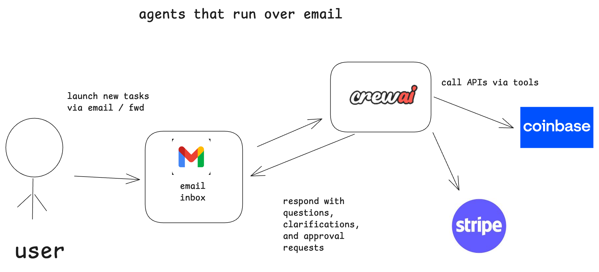
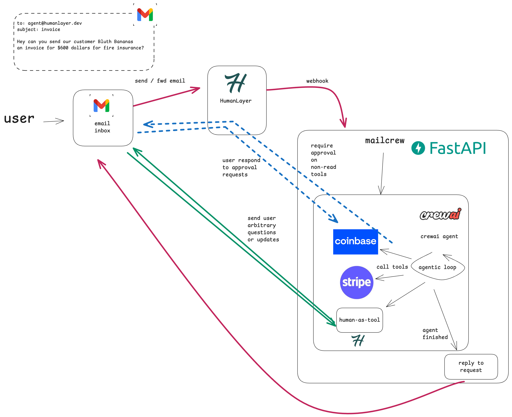
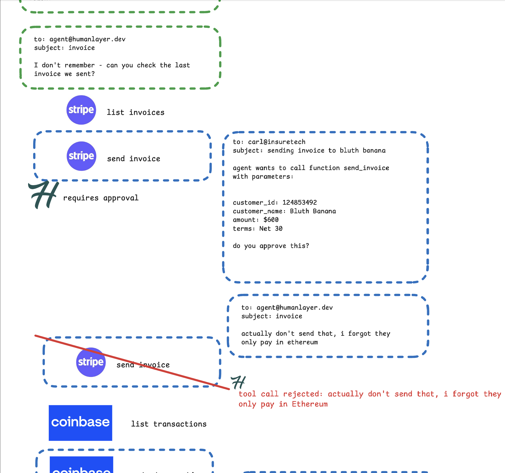
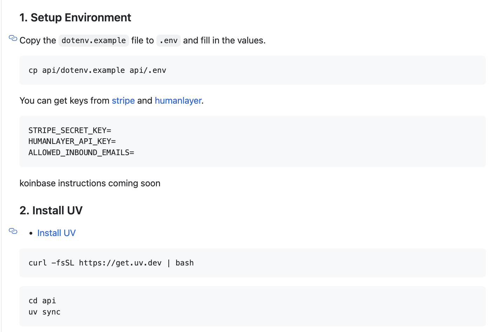
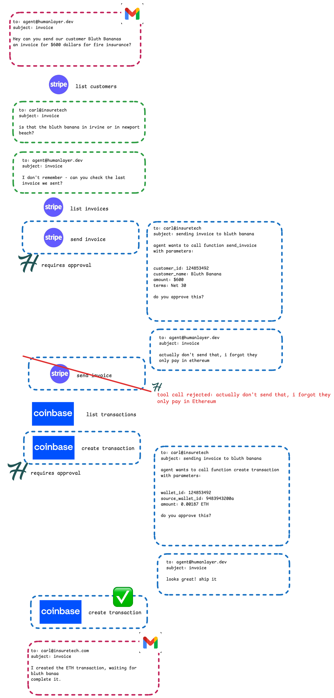
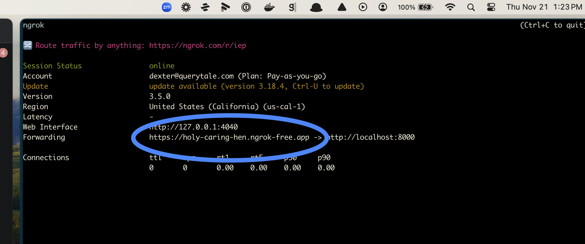
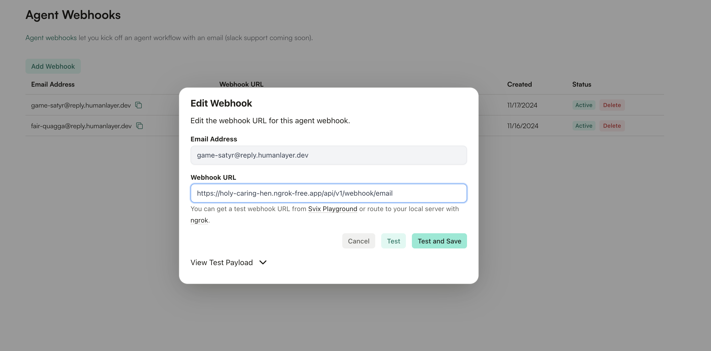

Mailcrew
===========


Mailcrew is a language model agent that performs various tasks over email, including interacting with Stripe and Coinbase APIs.

<div align="center" style="width: 50%; margin: auto;">
  
</div>


Quick Links
----------------

| [Architecture](#architecture) | [Example Agent Task](#example-agent-task) | [Usage](#usage) | [Video Overview](https://www.youtube.com/watch?v=f_cKnoPC_Oo) |
|------------|----------|----------|----------|
| [](#architecture) | [](#example-agent-task) | [](#usage) | [](https://www.youtube.com/watch?v=f_cKnoPC_Oo) |

- [Why Mailcrew?](#why-mailcrew)
- [Stack](#stack)
- [Architecture](#architecture)
- [Usage](#usage)
  - [Disclaimer](#warning-disclaimer)
  - [Setup](#1-setup)
  - [Install UV](#2-install-uv)
  - [Run Server](#3-run-server)
  - [Route a webhook to your local server](#4-route-a-webhook-to-your-local-server)
  - [Create an Agent Webhook in Humanlayer](#5-create-an-agent-webhook-in-humanlayer)
  - [Send an email to the agent](#6-send-an-email-to-the-agent)
- [Deploying](#deploying)

Why Mailcrew?
---------


I am super interested in "alternative interfaces" for language models, like slack, email, and SMS,
and wanted to explore what would be a good UX for an an agent that operates over email. 

If you've followed me for a while, you know I'm also very bullish on incorporating
human review into AI Agents so they can be given bigger and more impactful tasks.

Since there are some very cool new SDKs just launched from [stripe](https://docs.stripe.com/agents) and [coinbase](https://github.com/coinbase/coinbase-sdk-ai-agent-sample),
I thought it would be super cool to see how we could use these to build an agent that interacts with these APIs over email.

At the end of the day, we're completing a core loop:

- craft a task in natural language, e.g. "invoice joe for $100" or  "buy $1000 of BTC" 
- send that task to an "agent inbox" via email
- an agent drafts a tool call, then emails the requester for approval 
- the user responds to the email in natural language, either approving or giving feedback
- upon approval the task is completed

If there are any ambiguities or questions, I wanted the agent to be able to ask follow up questions via email.

Architecture
----


- Python FastAPI
- Agent SDKs from Stripe and Coinbase
- CrewAI agent for processing
- HumanLayer for agent->human communication over email

A more detailed architecture diagram:


### Example Agent Task

And an example of a conversation flow:





Usage
----

I can't believe I have to say this but...

### :warning: DISCLAIMER

USE TEST KEYS, NOT PRODUCTION, UNTIL YOU HAVE A FEEL FOR HOW THE AGENT WORKS AND HOW THE APPROVAL PROCESS WORKS.

IF YOU PUT IN YOUR STRIPE SECRET KEY, THIS AGENT CAN ACT ON YOUR BEHALF IN STRIPE.

IF THIS AGENT DOES ANYTHING YOU DON'T LIKE, I CANNOT BE HELD RESPONSIBLE.

### :warning: /DISCLAIMER

great, with that out of the way, let's get started.

### 1. Setup Environment

Copy the `dotenv.example` file to `.env` and fill in the values.

```
cp api/dotenv.example api/.env
```

You can get keys from [stripe](https://dashboard.stripe.com/test/apikeys) and [humanlayer](https://app.humanlayer.dev).

```
STRIPE_SECRET_KEY=
HUMANLAYER_API_KEY=
ALLOWED_INBOUND_EMAILS=
```

koinbase instructions coming soon

### 2. Install UV

- [Install UV](https://docs.astral.sh/uv/getting-started/installation/)

```
curl -fsSL https://get.uv.dev | bash
```

```
cd api
uv sync
```

### 3. Run Server

Still in the `api` directory:

```
make run
```

or 

```
uv run -m app.main
```

The server is running on port 8000, you can now set up email routing so it can receive emails.

### 4. Route a webhook to your local server

We recommend using ngrok to route the webhook to your local server. 

In another terminal

```
brew install ngrok
```

```
ngrok http 8000
```

NGROK will output a URL you can use - 



### 5. Create an Agent Webhook in Humanlayer

Navigate to [Humanlayer](https://app.humanlayer.dev) and create a new agent webhook. 

This will give you a specific email address to send new tasks to.

set this as the webhook url in Humanlayer and test it out. make sure to include the `/api/v1/webhook/email` in the path.



Now you can send an email to the address you got from Humanlayer and it will be routed to your local fastapi.

### 6. Send an email to the agent

Use the email address you got from Humanlayer and send an email to the agent.

You can test something like "create a new customer Joe's Plumbing and invoice them for $100"

> To: game-satyr@reply.humanlayer.dev
> Subject: new invoice
> 
> create a new customer Joe's Plumbing and invoice them for $100 - thanks!

From there, the agent will converse with you to execute the task over email. 

You can review the results in your stripe dashboard, and see the agent actions and responses in the Humanlayer dashboard.

## Deploying

If you want to deploy this to the public web, you can skip the ngrok step and just set the webhook url to your deployed server.

